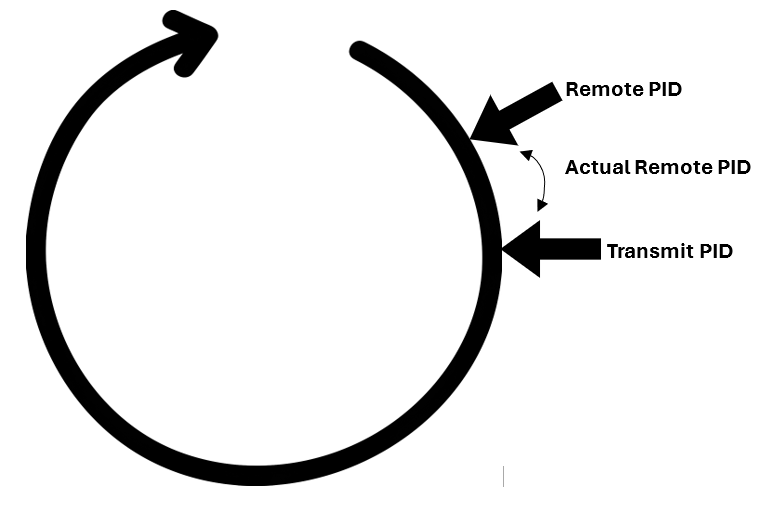

# ESP Mesh v2

## Changes from v1
v1 focused on experimenting with a good design for reliable packet transfer using both espnow protocol and later upgraded to 'PainlessMesh'

This lib will work together with 'PainlessMesh' and add functionality on top of it and on top of v1 in two major ways

- This new version will no longer have a dedicated master or slave device.\
  Each device will be a Slave(incoming connection) while the Masters will simply be Slaves with added responsibilities
- This new version will also add the functionality of synced variables across connection pairs.\
  This feature will greatly simplify and optimize sharing states and config data between devices.\
  To remove the possibility of race conditions, each synced variable(group) will be read-only for the subscriber and write-only for the publisher

The highest level class will be the ```ESP_Mesh```\
This will be a completely static class essentially with only one instance. This instance will control all connections dynamically\
The next level class will be ```ESP_Mesh_Connection``` which can assume the master or slave role and represent one connection pair.\
```ESP_Mesh``` will do the job of rerouting packets to the correct instance.

### Transmission Types:
#### Simple Packet
A simple packet is sent without any acknowledgment or need for connection, although by default they won't send or receive without a connection.

#### Persistent Packet
A persistent packet is designed to be very stubborn and attempt to resend even between disconnects.
It will also prevent packet duplication with the use of packet ID's (*for each boot instance).
A persistent packet will send in between reconnects, even reboots (*reboots is where packet duplication can occur).
(Acknowledgement packets with packet-ID will always be sent out by the recipient signalling the packet has ben received).

A persistent packet can be set with or with out a timeout(for when a packet becomes irrelevant).
A persistent packet can be setup with a timer to prevent overflowing the send buffer.

~~It can also be set up with a group ID, to have more control over packet groups.~~\
~~(eg. group 23 updates its status but is also sending an old group 23 packet. Replace that packet instead of extra transmission)~~


#### Buckets
This is a more complex type of communication that will be handled behind the scenes using a combination of previous two packet types.

It is designed to sync a common variable or structure between multiple devices.\
The variables will automatically resync on device reset or disconnect.

Although the ideal version of this is for both devices to have read-write capabilities, racing conditions prevent that from being simple.\
To ensure data integrity, each bucket will be one way only: The publisher can write-only, the subscriber can read-only.

This form will be designed to avoid needless retransmissions and yet be perfectly reliable.

Each "Bucket" will be identified using a unique id number. This number needs to be unique for all buckets relative to the target device.\
You can have the same bucket id for each set (published and subscribed buckets). (Hint: this is how you can seamlessly set up a single read-write bucket but racing will be possible)

For each bucket, there is a subscriber and a publisher.\
The publisher owns the bucket and ultimately controls its state. The publisher also defines the bucket type and size.\
The subscriber is expected to know the type and size of the bucket in advance. The buckets are also designed to have flexible sizing but must be managed manually and very carefully

### Protocol

Each device(Master & Slave) will have a set of transmit, remote and local PID(Packet Identifier) for each connection pair(Master <-> Slave).\
The local PID is always accurate but the device will attempt to always keep the remote PID up to date.

Theoretically, both devices in a communication pair can be masters with no real issues.\
The only major sideeffect is unnecessary transmissions that only one device should be carrying out

Each JSON formatted packet will come with one required field: the packet command-type (```type```)

```
{
  "type": int,
}
```

There will be a second field that will be common if a few packets named ```ack``` of bool type. (default assumed false).
This will denote whether the received packet is a request or acknowledging a previous request.

These are all the packet types:
```
"type"
  0 = null
  1 = beacon packet
  2 = connection request
  3 = Heartbeat Packet
  4 = PID realignment
  5 = simple packet
  6 = persistent packet
  7 = bucket request
  8 = bucket publish
  9 = packet ack
```
Simple topology of communication:
```
  Master --> Beacon Packet (simple invitation to connect)
  Master --> Beacon Packet (simple invitation to connect)
  ...
  Master --> Beacon Packet (simple invitation to connect)
  Master --> Beacon Packet (simple invitation to connect)
  Slave --> Connection Request (send current transmitting PID [0-255])(does NOT require a beacon packet to initialize if target master is known)
  Master --> Connection Request ack (send Master's current transmitting PID [0-255])
  Master --> Heartbeat
  Slave --> Heartbeat ack
  Master --> Heartbeat
  Slave --> Heartbeat ack
  Master --> Heartbeat
  Slave --> Heartbeat ack
  ...
```
The PID sent will be an unsigned byte (in reality, the PID can be any range but smaller values are enough and simpler)\
The PID will wrap around an unsigned byte value 0-255

**Each device will track three values for PID:**

```
Local_PID -> Receiving PID
Remote_PID -> Remote device receiving PID
Transmit_PID -> Current transmitting PID
```

**NOTE:** Even though certain packets are denoted as "Only Slave sends" a master can also send this type of packet.\
This is only to clarify the purpose of the specific packet. After all, each master is just a slave with added functionality.


```
Beacon packet (info):
  Only master sends this packet. Just invitation packet. [Packet Command]

  {
    "type": 1
  }
```
```
Connection request (request):
  Only Slave sends this packet. [Packet Command][transmit slave PID]

  {
    "type": 2
    "pid" = byte // the next PID that will be transmitted from this device
  }
```
```
Connection request ack (response):
  Only Master Sends. ACK Packet. [Packet Command][Ack][transmit master PID]

  {
    "type": 2
    "ack": true
    "pid" = int // negative = reset device. all packet id's are valid. otherwise, byte wrap around 0-255
  }

  master assumes successful connection after this packet is sent
  slave assumes successful connection only after this packet is received

  If slave never recives this packet because it dropped, the master will shortly timeout and disconnect then try again.
```
```
Heartbeat Packet (request):
  Only Master Sends. [Packet Command]

  {
    "type": 3
  }
```
```
Heartbeat Packet ack (response):
  Only Slave Sends. [Packet Command][Ack]

  {
    "type": 3
    "ack": true
  }
```

#### PID realignment
This is used when the Transmit PID outpaces the Remote PID by too much.\
Before another packet can be safely sent,
  the remote PID must be set correctly otherwise the receiver might throw out new packets as duplicates

If Receiver gets a PID that is invalid (behind the actual remote PID), then this is an error.\
The ```err``` (bool type) will be set to warn of a mismatch. The connection will then be reset by the device that originally requested the alignment.\

The acknowledging device will simply assume that the incorrectly received PID was a delayed packet resulting in the wrong number.
```
PID realignment (request):
  Either Device Sends. [Packet Command]

  {
    "type": 4
    "pid": int // positive 0-255
    // This tells the receiver what to set receive-PID to
  }
```
```
PID realignment ack (response):
  Either Device Sends. [Packet Command][Ack][PID]

  {
    "type": 4
    "ack": true
    "pid": int // the pid must match the requested one
    "err": bool // defaults to false. should only be set when the acknowledging device can't set the PID
  }
```

```
Simple Packet (info):
  Either Device Sends. [Packet Command][PayLoad]

  {
    "type": 5
    "msg": String
  }
```
#### In the case of persistent packets:
Slave and Master will both implement a circular buffer of sorts.\
This buffer is not limited to 0-255 but not a lot is needed.

This circular buffer will be split into two parts. For simplicity this will probably be two half's (128 and 128)

Each device will track three PID values:\
Transmit_PID\
Remote_PID\
Local_PID

The receiver will receive ANY PID from the first half of the buffer (relative to local PID), anything behind will be considered duplicate.\
When a new valid PID is received, the local PID will be automatically updated and pushed forward.\
If acknowledged pushing forward of the local PID happens often enough, PID realignment may never be needed.

This is designed that every packet is required to have a unique PID and none can be reused.\
Its always safer to use the next PID than to realign and attempt to reuse an old PID because of possible packet delays and then conflicts later




```
Persistent Packet  (expects packet ack)(info)(request):
  Either Device Sends. [Packet Command][PID][PayLoad]

  {
    "type": 6
    "pid": int // Transmit PID
    "msg": String
  }
```

#### Buckets
These type of packets will use the Exact same PID system to send the bucket packets.\
Each bucket will be given an unique ID.

```
Bucket Request (expects packet ack)(request)
  Either Device Sends. [Packet Command][PID][Bucket ID][PayLoad]
  {
    "type": 7
    "pid": int // Transmit PID
    "bck": int // bucket ID
  }

// this command should only be used when a subscriber restarts as the publisher can't know that
```
```
Bucket publish (expects packet ack)(info)(request)
  Either Device Sends. [Packet Command][PID][Bucket ID][PayLoad]
  {
    "type": 8
    "pid": int // Transmit PID
    "bck": int // bucket ID
    "msg": String
  }
```

#### Packet Acknowledge
This is the general ack packet that should be used by the Persistent-Packet and both forms of the Bucket_Packets\
The PID returned is the exact that is received, even if the packet hasn't been applied due to duplication.

There will be an extra ```err``` field that will flag if the packet wasn't applied due to misaligned PID's.\
This error flag will not be set if it is a simple packet duplicate.\
If the sender gets an error flag, a realignment will be issued and the packet will be resent.
```
Packet ack (response):
  Either Device Sends. [Packet Command]

  {
    "type": 9
    "pid": int // the exact packet ID that is received
    "err": bool // defaults to false. Only in the case of packet being behind local_PID by > 1
  }
```